# OPNsense Wireless Security Lab

## Overview

This lab focuses on simulating and securing a wireless company network using OPNsense and Hyper-V.

The goal was to test wireless security concepts such as authentication, guest network isolation, firewall rules and IDS monitoring in a virtual lab environment.

Since no physical wireless access point was used, the wireless networks were simulated with Hyper-V internal switches and OPNsense interfaces.

---

## What This Lab Demonstrates

- Simulated employee wireless network using OPNsense
- Simulated guest wireless network
- Captive Portal authentication with local users
- Guest network isolation from internal WLAN
- Firewall rule design and validation
- Suricata IDS monitoring on WLAN traffic
- Nmap scan detection
- Practical troubleshooting in a virtual network lab

---

## Lab Environment

| Component | Description |
|---|---|
| Hypervisor | Microsoft Hyper-V |
| Firewall / Router | OPNsense |
| Employee Client | Windows 11 VM |
| Guest Client | Windows 11 VM |
| Authentication | OPNsense Captive Portal |
| IDS Engine | Suricata |
| Test Tool | Nmap |

---

## Network Design

| Network | Interface | Gateway | Purpose |
|---|---|---|---|
| LAN | LAN | 192.168.10.1/24 | Management / existing lab network |
| WLAN | WLAN | 192.168.40.1/24 | Simulated employee wireless network |
| Guest_WLAN | Guest_WLAN | 192.168.50.1/24 | Simulated guest wireless network |

---

## Hyper-V Switches

| Switch Name | Type | Purpose |
|---|---|---|
| WAN-Switch | Existing lab connection | Provides upstream connectivity |
| WLAN_Switch | Internal | Simulates employee wireless access |
| Guest_Switch | Internal | Simulates guest wireless access |

---

## Security Controls

### Employee WLAN

The employee WLAN was configured as a simulated secure wireless network.

Security controls included:

- Captive Portal authentication
- Local user authentication
- Firewall rules for WLAN traffic
- Suricata IDS monitoring

The WLAN client used the address:

| Client | IP Address |
|---|---|
| Windows 11 WLAN Client | 192.168.40.101 |

---

### Guest WLAN

The guest network was separated from the employee WLAN.

The goal was to allow guest access while preventing access to internal WLAN resources.

The guest client used the address:

| Client | IP Address |
|---|---|
| Windows 11 Guest Client | 192.168.50.154 |

---

## Firewall Rule Summary

### WLAN

| Action | Source | Destination | Purpose |
|---|---|---|---|
| Pass | WLAN net | any | Allow authenticated WLAN users |
| Block | any | WLAN net | Block unauthorized access to WLAN |

### Guest_WLAN

| Action | Source | Destination | Purpose |
|---|---|---|---|
| Block | Guest_WLAN net | WLAN net | Prevent guests from reaching WLAN |
| Pass | Guest_WLAN net | any | Allow guest internet access |

---

## Authentication Test

Captive Portal was used to simulate wireless user authentication.

A failed login attempt showed:

| Test | Result |
|---|---|
| Wrong credentials | authentication failed |

A successful login with the employee user allowed network access.

| Test | Result |
|---|---|
| Correct employee credentials | Login successful |
| Internet access after login | Successful |

NeverSSL was used to validate access after authentication because it uses HTTP and works well for Captive Portal testing.

---

## IDS Monitoring

Suricata was enabled on the WLAN interface in IDS mode.

A port scan was generated from the WLAN client using Nmap.

| Detection | Result |
|---|---|
| Tool used | Nmap |
| Source | 192.168.40.101 |
| Destination | 192.168.10.1 |
| Alert | ET SCAN Possible Nmap |
| Action | allowed |

The scan was detected and logged by Suricata.

---

## Guest Network Isolation Test

The guest client attempted to reach the WLAN gateway.

| Test | Result |
|---|---|
| Source | 192.168.50.154 |
| Destination | 192.168.40.1 |
| Protocol | ICMP |
| Result | Blocked |

The ping failed with 100% packet loss, and the firewall log confirmed that the traffic was blocked by the Guest_WLAN rule.

---

## Validation Summary

| Test | Result | Status |
|---|---|---|
| WLAN client received IP address | 192.168.40.101 | Passed |
| Guest client received IP address | 192.168.50.154 | Passed |
| Failed Captive Portal login | authentication failed | Passed |
| Successful Captive Portal login | Network access allowed | Passed |
| Nmap scan detection | ET SCAN Possible Nmap | Passed |
| Guest to WLAN access | Blocked | Passed |
| Firewall log validation | Block rule matched | Passed |

---

## Screenshots

### 1. OPNsense Interfaces Overview

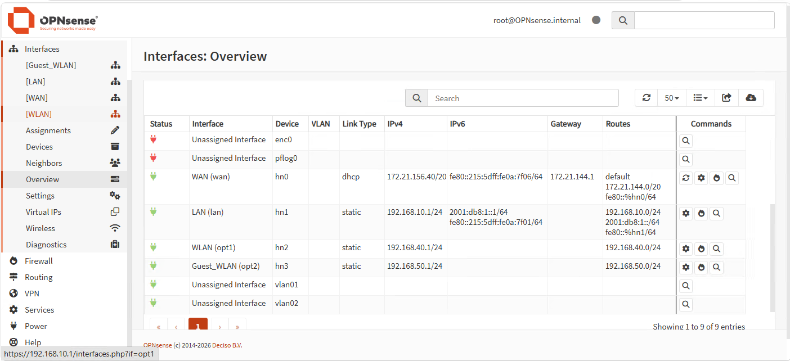

Shows the configured OPNsense interfaces, including LAN, WLAN, and Guest_WLAN with their assigned IP networks.

### 2. DHCP Ranges

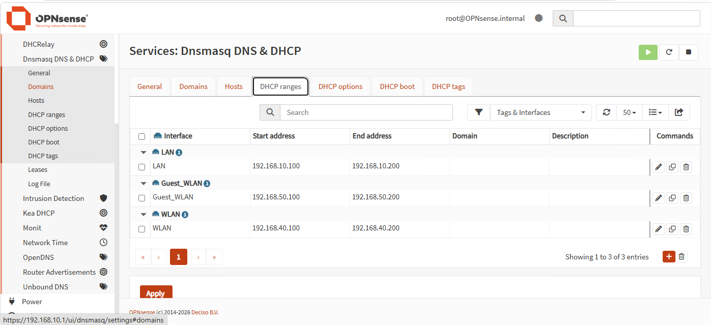

Shows the DHCP ranges configured for LAN, WLAN, and Guest_WLAN.

### 3. WLAN Firewall Rules

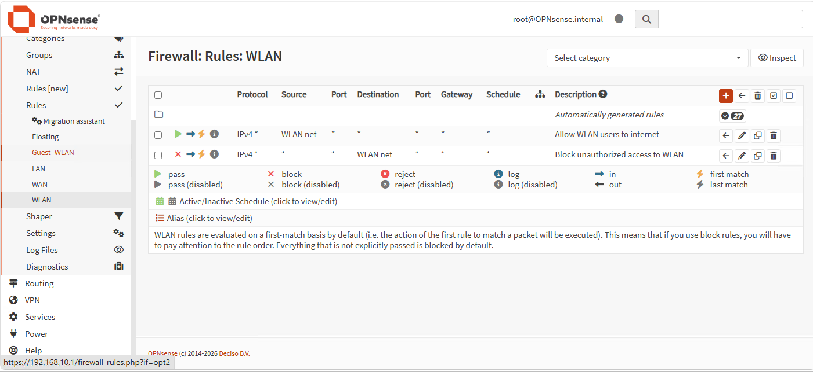

Shows the WLAN firewall rules allowing WLAN users to access the network and blocking unauthorized access to WLAN.

### 4. Guest_WLAN Firewall Rules

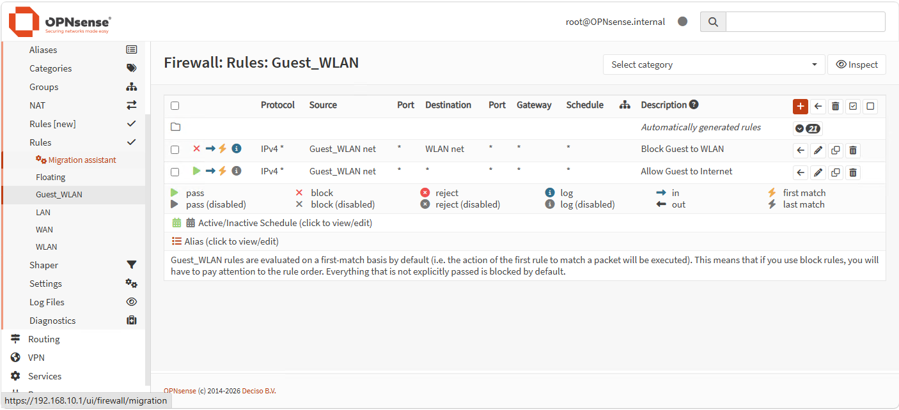

Shows the Guest_WLAN firewall rules where guest traffic to WLAN is blocked before general internet access is allowed.

### 5. Captive Portal Login

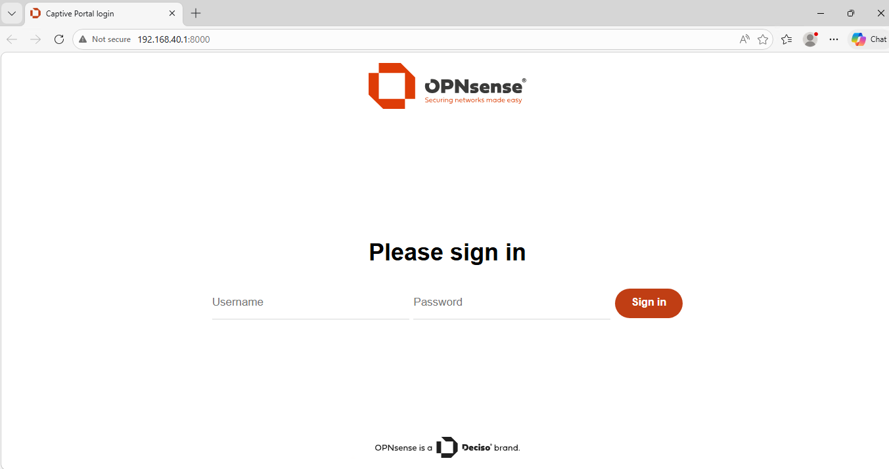

Shows the OPNsense Captive Portal login page presented to the WLAN client before authentication.

### 6. Authentication Failed

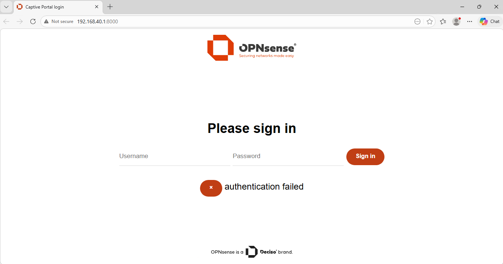

Shows a failed Captive Portal login attempt where incorrect credentials were denied.

### 7. Successful Captive Portal Login

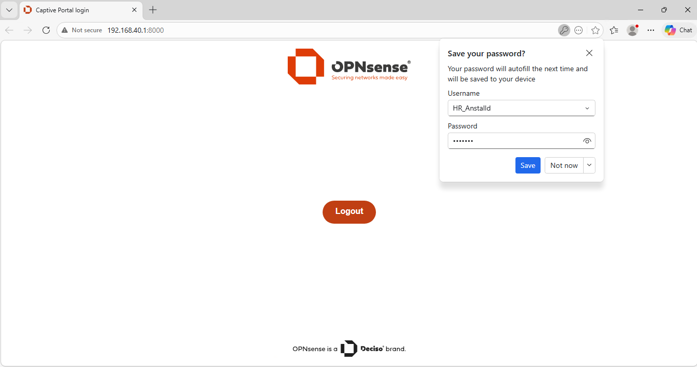

Shows a successful Captive Portal login with an active authenticated session.

### 8. Suricata Nmap Alert

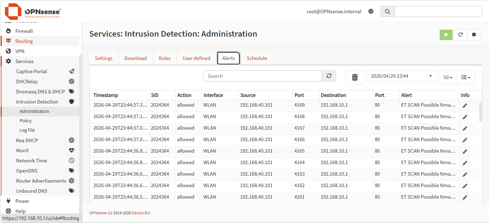

Shows Suricata IDS alerts detecting Nmap scan activity from the WLAN client.

### 9. Guest Ping Blocked

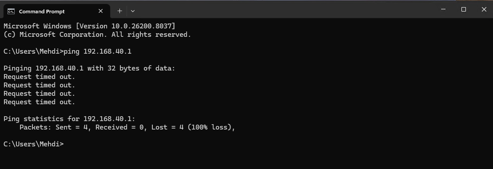

Shows the Guest_WLAN client failing to ping the WLAN gateway, confirming network isolation.

### 10. Firewall Live View Block

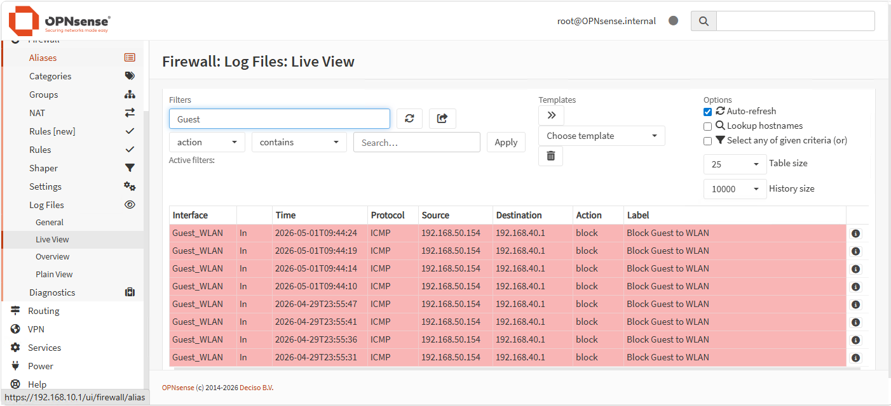

Shows OPNsense firewall logs blocking ICMP traffic from Guest_WLAN to WLAN.

### 11. Captive Portal UDP Block

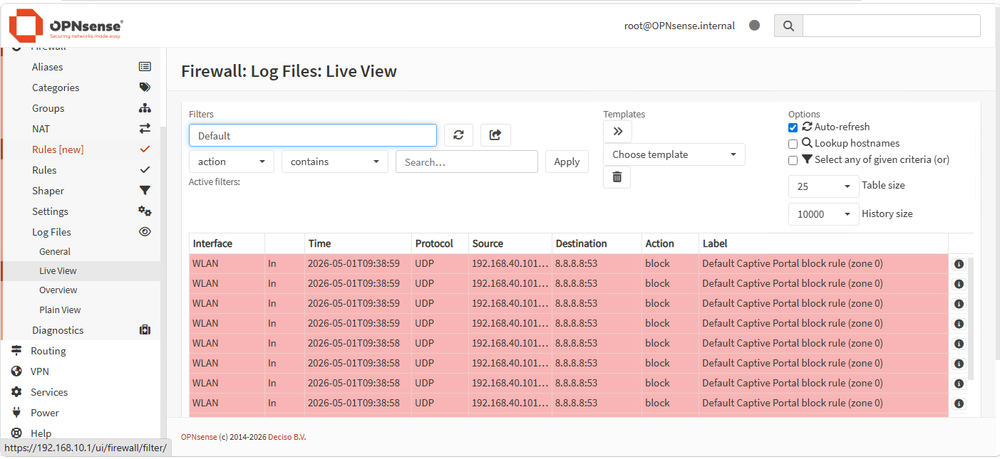

Shows the Captive Portal default block rule blocking unauthenticated UDP/DNS traffic from the WLAN client.

---

## Documentation

Detailed lab documentation, including:

- Step-by-step implementation
- Interface configuration
- DHCP configuration
- Firewall rule explanation
- Captive Portal authentication
- Suricata IDS validation
- Guest network isolation test
- Troubleshooting notes

See:

docs/lab-documentation.md

---

## What I Learned

- How to simulate wireless networks in Hyper-V using OPNsense
- How Captive Portal can be used for authentication testing
- How guest networks reduce risk through isolation
- How firewall rule order affects traffic flow
- How Suricata detects suspicious traffic such as Nmap scans
- Why HTTPS can behave differently with Captive Portal before authentication
- How to validate security controls with logs and practical tests

---

## Author

Muhammad Mehdi  
IT Security Developer Student
